# OpenCV Integration with Unreal Engine

This guide will outline the workflow to install OpenCV C++ and Zbar libraries in Visual Studio 2019 and setup up a project that detects QR codes for devices built on the Windows x64 platform. 

If you would like to build this project on x86 or ARM, you will need to cross-compile the OpenCV and Zbar libraries to match the desired platform. 

## Prerequisites

Note: You may want to build the OpenCV and ZBar libraries yourself to work for different targeted architectures such as `x86`, `ARM`, and `ARM64`. OpenCV comes compiled in `x64` while ZBar 0.1 is compiled in `x86`. Below we use a `x64` ported version of ZBar and the pre-built OpenCV library files for simplicity of installation. 

1. Install [Visual Studio 2019 Community.](https://visualstudio.microsoft.com/free-developer-offers/)

2. Install OpenCV from the official website [here.](https://opencv.org/releases/) The version that will be used is `OpenCV – 4.5.2`. Download the `opencv-4.5.2-vc14_vc15.exe` Windows executable and run to extract to a desired file path. The path we will use here is `C:\`

3. Git clone `ZBarWin64` from this repository [here.](https://github.com/dani4/ZBarWin64) The path we will use here is `C:\`

Resources on OpenCV:
- [OpenCV Documentation](https://docs.opencv.org/master/d9/df8/tutorial_root.html)
- [OpenCV Releases](https://opencv.org/releases/)
- [OpenCV Repository](https://github.com/opencv/opencv)
- [OpenCV Installation and Building from source](https://docs.opencv.org/master/d3/d52/tutorial_windows_install.html#tutorial_windows_gitbash_build)

Resources on ZBar and Source Code:  
- [ZBar Source Forge (version 0.1)](http://zbar.sourceforge.net/)  
- [ZBar Repository (version 0.20+)](https://git.linuxtv.org/zbar.git)
- [ZBar API documentation](http://zbar.sourceforge.net/api/annotated.html)
## Add OpenCV and ZBar to your `PATH` enviornment variable. 

We do this by going to:  
`Control Panel -> System Properties -> Advanced -> Enviornment Variables` and adding a new entry to the `Path` variable. 

Add a path to the OpenCV and Zbar pre-built binaries from the chosen path of installation:  
- OpenCV binaries - Ex. `C:\opencv\build\x64\vc15\bin`  
- Zbar binaries - Ex. `C:\Zbar\lib`  
- Zbar libiconv binary - Ex. `C:\Zbar\zbar\libconv\dll_x64` 

Your system path variable should look something like the below:

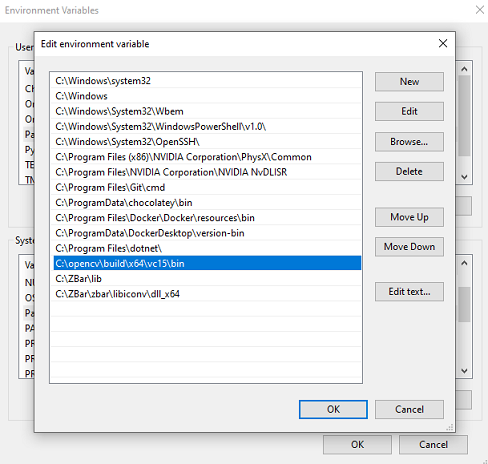

If you have Visual Studio open already, you may need to restart the IDE for the environment variable changes to take effect.


## Visual Studio

Open Visual Studio and create a new Empty C++ Project. 

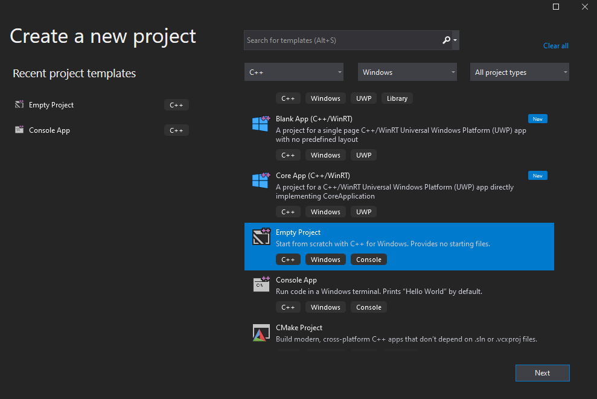


Change your build configurations to be `Debug` and `x64`. The precompiled libraries provided by OpenCV are built to run on `x64` so we need to match our project to the architecture of the imported libraries. 

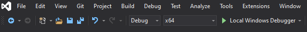  


Right click your project in the Solution Explorer and select Properties. Here we are going to add the paths to the library directories needed for the project and Link the necessary binaries. 

Navigate to `Configuration Properties->VC++ Directories` as shown below:


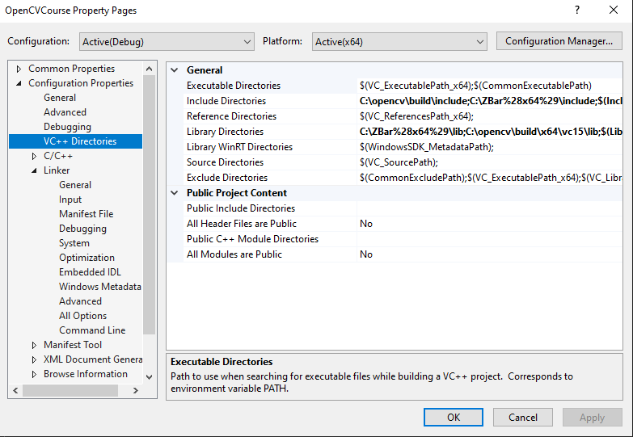

Under `General->Include Directories` add the following:  
- `C:\opencv\build\include`
- `C:\Zbar\include`

Under `General->Library Directories` add the following:
- `C:\opencv\build\x64\vc15\lib`
- `C:\Zbar\lib`

Navigate to `Linker->Input` as shown below:

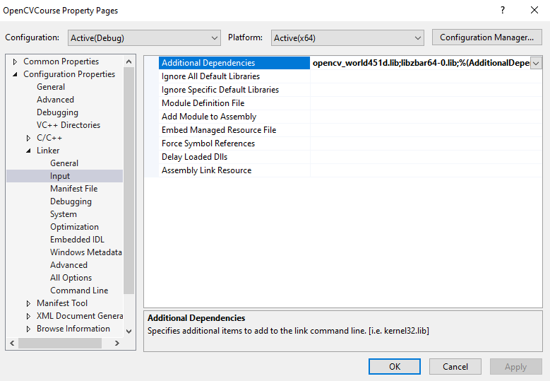

Add to the Additional Dependencies the following static library files:
- `opencv_world452d.lib`
- `libzbar64-0.lib`

`opencv_world452.lib` instead of `opencv_world452d.lib` is needed for when building for release.

You are now done setting up OpenCV and ZBar and can begin using these libraries in a project in Visual Studio!


## Errors and Issues

If you get an error about std::iterator being depreciated, suppress the warning by navigating to `Project->Properties->C/C++->Command Line` and under Additional Options add:  

`/D_SILENCE_CXX17_ITERATOR_BASE_CLASS_DEPRECATION_WARNING `

Information on C++17 depreciated features and how to modify the code can be found [here.](https://devblogs.microsoft.com/cppblog/c17-feature-removals-and-deprecations/)

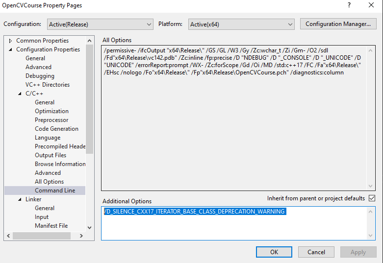


## Checking library binary architecture

In a UNIX command line, run:

`objdump -f <filename>`

## Additional Resources

https://learnopencv.com/barcode-and-qr-code-scanner-using-zbar-and-opencv/

https://devblogs.microsoft.com/cppblog/windows-arm64-support-for-cmake-projects-in-visual-studio/

https://www.youtube.com/watch?v=OZtVBDeVqCE

https://visualstudio.microsoft.com/downloads/#remote-tools-for-visual-studio-2019

https://oofhours.com/2019/09/20/windows-10-on-arm64/

https://docs.microsoft.com/en-us/visualstudio/ide/how-to-configure-projects-to-target-platforms?view=vs-2019


https://www.deciphertechnic.com/install-opencv-with-visual-studio/


UWP Hololens

https://github.com/microsoft/Windows-universal-samples/tree/master/Samples/CameraFaceDetection/cpp

https://github.com/microsoft/HoloLens2ForCV


Cross Compilation

http://baruch.siach.name/blog/posts/introduction_to_cross_compilation_part_1/

https://answers.opencv.org/question/199567/cross-compile-opencv-343-for-arm/


Third party library UE4

https://unreal.blog/how-to-include-any-third-party-library


## Windows on ARM and UWP

Windows 10 on ARM runs all x86, ARM32, and ARM64 UWP apps from the Microsoft Store. ARM32 and ARM64 apps run natively without any emulation, while x86 apps run under emulation. 


## CMake

Install latest release of CMake:

Used Windows x64 Installer: https://cmake.org/download/


## Getting Started in Unreal Engine
1. Download the Plugin repository locally through a `.zip` file or using `git clone https://github.com/Jasonlin1198/OpenCV-ZBar-Unreal-Plugin.git`.

2. Install OpenCV from the official website [here.](https://opencv.org/releases/) The version that will be used is `OpenCV – 4.5.1`. Download the `opencv-4.5.1-vc14_vc15.exe` Windows executable and run to extract to a desired file path.

3. Git clone `ZBarWin64` from this repository [here.](https://github.com/dani4/ZBarWin64)

Copy the contents of the OpenCV directory into the plugin's `Source/ThirdParty/OpenCVLibrary` directory.

Copy the `lib/`, `include/`, and `zbar/` directories of the ZBarWin64 repository into the plugin's `Source/ThirdParty/ZBarLibrary` directory. 


The Plugin directory should now look something like this:
```
|--Source
    |--ThirdParty
        |-- OpenCVLibrary/
            |-- build/
            |-- sources/
            |-- OpenCVLibrary.Build.cs
        |-- ZBarLibrary/
            |-- include/
            |-- lib/
            |-- zbar/
            |-- ZBarLibrary.Build.cs
```

Copy the modified plugin into the `Plugins/` directory of an Unreal Engine game. You are now ready to begin modifying the plugin's source code and utilize the created blueprints!

## Blueprint

Below we will go over how to use the implmentation of OpenCV and ZBar in an Unreal Engine project through Blueprints. The example uses the plugin's Scene Capture Component 2D to capture a scene view, processes the image to detect QR codes, and renders the output texture as an overlay on a player's HUD.


To get started with implmenting the HUD, first create a new HUD blueprint. Then create a GameMode blueprint and set the HUD class to the new HUD blueprint created. In the project settings, set the gamemode to the GameMode blueprint created.  

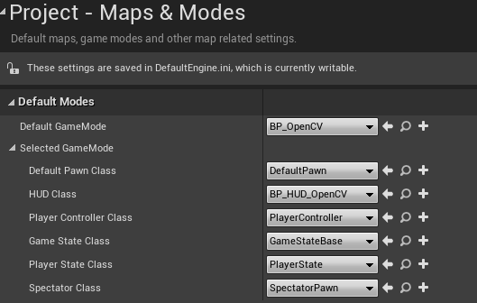

In the Event Graph of the HUD blueprint, we will begin implementing the code that will render the texture overlay when the game is played. Below is what the final code will look like:

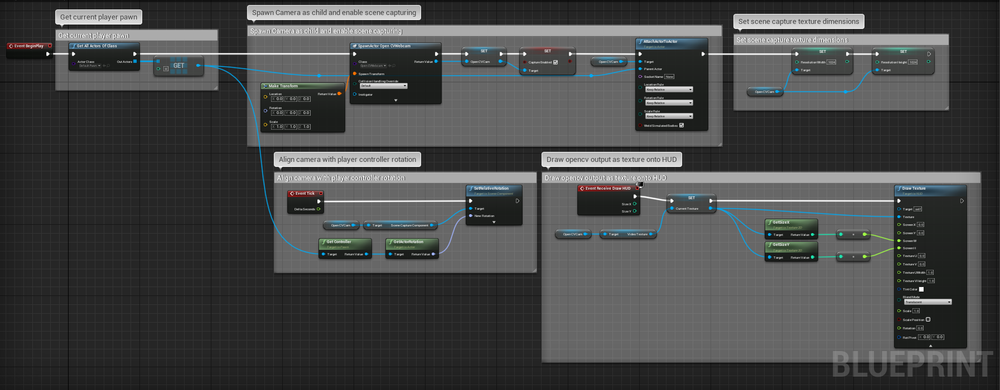


First we get the default pawn in the level by getting all actors of the Default Pawn class as an array. Here you can replace default pawn class with any other actor class you want to attach image detection functionality to.
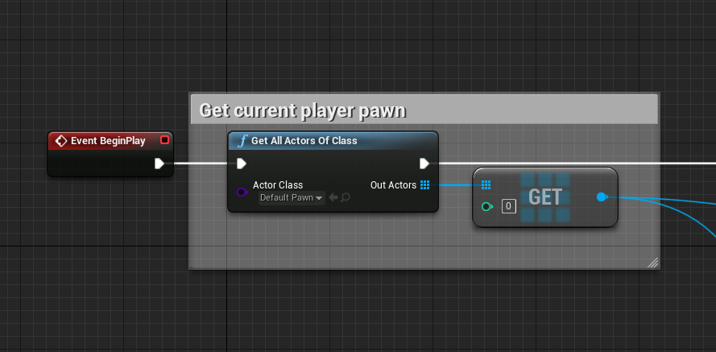

Spawn a new instance of the plugin's OpenCV Webcam actor, enable the capturing on the scene renderer, and attach the newly spawned actor as a child to our default pawn. Here we also set a variable called OpenCVCam that will hold reference to our OpenCV Webcam actor for later usage.
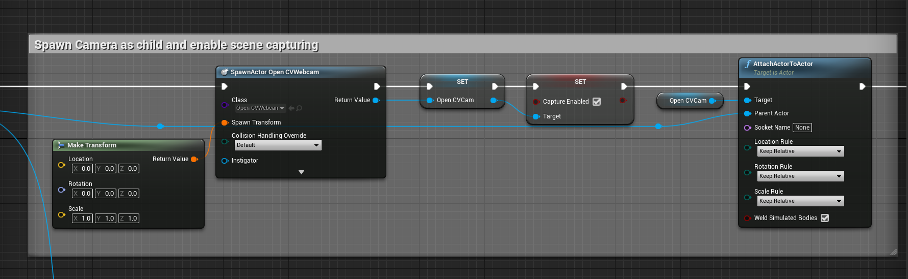

Optionally, we can set the resolution dimensions we want to capture for our image detection. Note: it may be required that the width and height are powers of 2 and are set to the same dimension. 
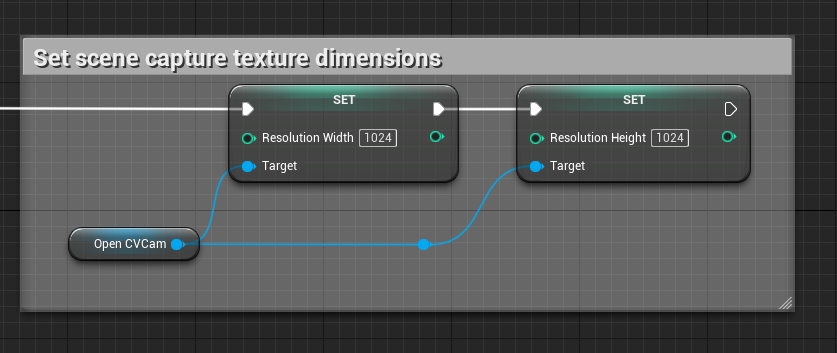

When attaching our OpenCV Webcam to the default pawn, the player rotations are not captured since the default pawn handles camera rotations in the player controller component. To account for rotation in play mode, set the OpenCVCam's Scene Capture Component rotation to the player controller's rotation. 
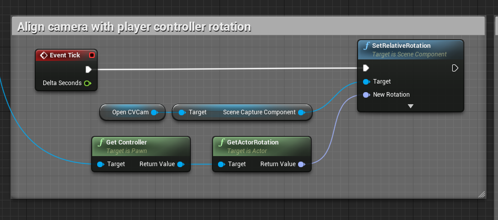

HUD blueprints use a unique event that allows us to draw textures on the HUD. We set the output video texture from our OpenCVCam actor to a variable called CurrentTexture and use it as input to the Draw Texture node. We get the X and Y dimensions of the video texture and tell Draw Texture that those are the dimension sizes we want to render on our screen. 
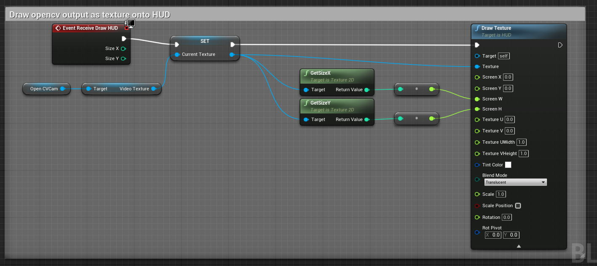


To test if everything is working, create objects with textures set to QR codes. Here we create a cube and set the material to a material that uses a sample QR Code as a texture. 

Click the dropdown to the right of the Play button in the Editor Toolbar and select `Advanced Settings`.
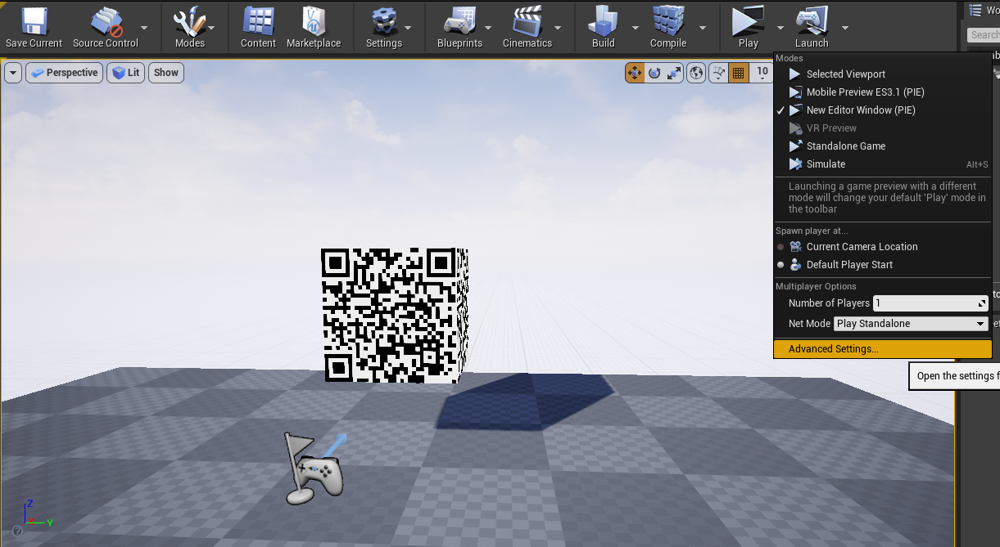

Set the `New Viewport Resolution` to be the same resolution as the texture resolution of the OpenCVCam actor.
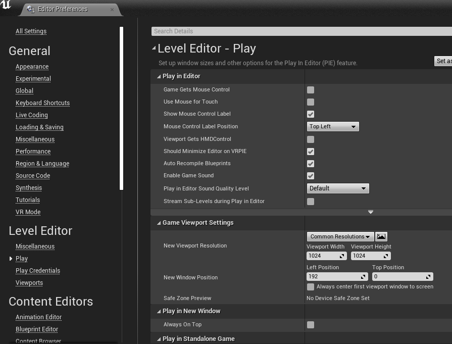

Run the game and you should see OpenCV's output texture superimposed onto the player's viewport!

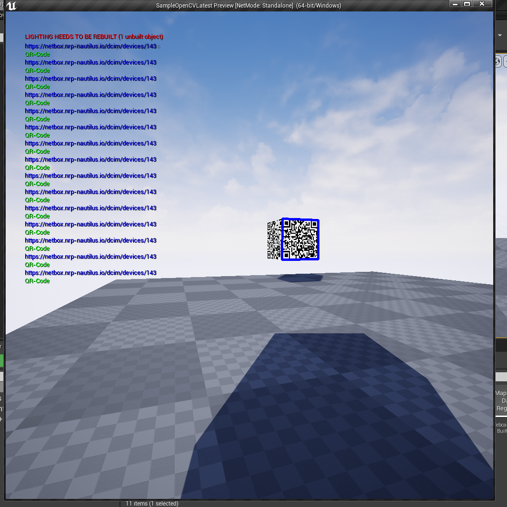